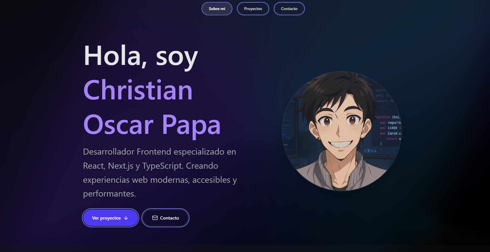

# 🌌 CV / Portfolio — Christian Oscar Papa



> 💼 **Desarrollador Frontend especializado en React + TypeScript**  
> Creando experiencias digitales modernas con Next.js, animaciones fluidas y un diseño accesible y escalable.

---

## ✨ Características principales

- 🎬 **Intro animada** — Splash screen con animación del nombre y soporte para `prefers-reduced-motion`.
- 🧭 **Navegación Sticky** — Barra superior con scrollspy y menú móvil accesible.
- 🧩 **Secciones completas** — Hero, Sobre mí (ES/EN), Proyectos, Contacto.
- ♿ **Accesibilidad avanzada** — Navegación por teclado, contraste AA y focus management.
- ⚡ **Performance optimizada** — Lighthouse ≥90 en todas las métricas.
- 🔍 **SEO profesional** — Metadata completa, Open Graph, Twitter Cards y sitemap automático.

---

## 🛠️ Tecnologías

| Tecnología            | Uso principal                            |
| --------------------- | ---------------------------------------- |
| **Next.js 15**        | App Router, Server Components            |
| **TypeScript**        | Tipado estricto y seguro                 |
| **Tailwind CSS**      | Tokens personalizados, diseño responsive |
| **Framer Motion**     | Animaciones accesibles                   |
| **Lucide React**      | Iconos SVG optimizados                   |
| **ESLint + Prettier** | Código limpio y consistente              |

---

## ⚙️ Instalación y uso

```bash
# 1️⃣ Instalar dependencias
npm install

# 2️⃣ Ejecutar en desarrollo
npm run dev

# 3️⃣ Build para producción
npm run build

# 4️⃣ Ejecutar build
npm start

# 5️⃣ Linting
npm run lint
📜 Scripts disponibles
Script	Descripción
npm run dev	Servidor de desarrollo (Turbopack)
npm run build	Build optimizado para producción
npm run start	Ejecuta el build
npm run lint	Verifica el código con ESLint

🌐 Despliegue en Vercel
bash
Copiar código
# Deploy manual
vercel

# O conectar el repositorio directamente en vercel.com
🔧 El proyecto está optimizado para Vercel, con rutas estáticas y assets optimizados mediante next/image.

📱 Diseño responsive
📏 Mobile First

💻 Breakpoints: sm, md, lg, xl

🧮 Layouts con CSS Grid y Flexbox

♿ Accesibilidad
✅ Contraste AA
✅ Navegación por teclado
✅ Etiquetas ARIA
✅ Estados de foco visibles
✅ Respeto por prefers-reduced-motion

🚀 Performance
⚡ Lighthouse ≥90

🖼️ Imágenes optimizadas con next/image

🧩 Code splitting automático

📦 Bundle minimalista sin dependencias pesadas

🧭 Estructura del proyecto
bash
Copiar código
src/
├── app/
│   ├── layout.tsx          # Layout principal y metadata
│   ├── page.tsx            # Página principal
│   └── sitemap.ts          # Generador de sitemap
├── components/
│   ├── IntroSplash.tsx     # Intro animada
│   ├── NavBar.tsx          # Navegación sticky
│   ├── AboutMe.tsx         # Sección sobre mí
│   ├── ProjectsGrid.tsx    # Grid de proyectos
│   ├── ProjectCard.tsx     # Tarjeta de proyecto
│   └── Contact.tsx         # Sección de contacto
└── lib/
    └── motion.ts           # Variantes de Framer Motion
🎨 Personalización
🎨 Colores
Definidos en tailwind.config.ts con tokens personalizados.

🌀 Animaciones
Centralizadas en lib/motion.ts, respetando prefers-reduced-motion.

🧾 Contenido
Proyectos → ProjectsGrid.tsx

Datos personales → AboutMe.tsx y Contact.tsx

Metadata SEO → layout.tsx

📄 Licencia
© 2024 Christian Oscar Papa
Todos los derechos reservados.

```
